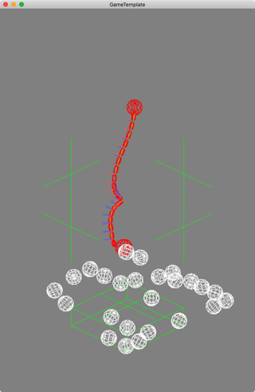

# Bullet Physics SDK test with my framework

## 概要
Bullet Phisics SDKを使う練習

## 利用した外部ライブラリ
+ GameTempalte
  
  専門学校の授業で使っている拙作フレームワーク

+ OpenGL 1.1
+ GLFW 3.3
+ OpenAL
+ glm 0.9.9.5
+ stb_image 2.3.4
+ fontstash
+ stb_truetype 1.15

## License
License All source code files are licensed under the MPLv2.0 license

[MPLv2.0](https://www.mozilla.org/MPL/2.0/)
